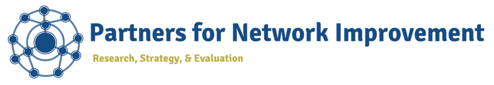
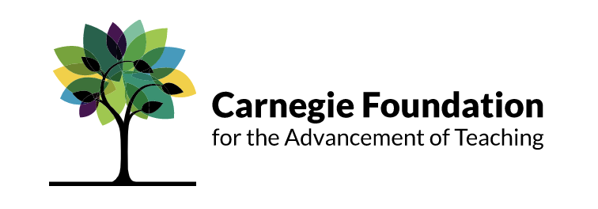

```{r setup, include=FALSE} 
knitr::opts_chunk$set(warning = FALSE, message = FALSE, dpi=600, tab.topcaption = TRUE, fig.topcaption = TRUE, fig.width=6.5, fig.height=3, fig.showtext=TRUE) 
```

```{r data, include = FALSE}
library(readr)
library(dplyr)
library(tidyverse)
library(ggplot2)
library(scales)
library(showtext)
library(flextable)
library(modelsummary)
library(forcats)
library(unikn)
library(officedown)
font_add_google("Merriweather", "merri")

network_data_2021<- read_csv("https://raw.githubusercontent.com/mpduff/aux_report_2022/main/aux_playset.csv")

network_roster_2021<- read_csv("https://raw.githubusercontent.com/mpduff/aux_report_2022/main/roster_The%20Instructional%20Network%20for%20School%20Improvement%20(INSI).csv")
```

```{r label_role_group_factors, include=FALSE}
network_data_2021$net_role<-factor(network_data_2021$net_role,
levels=c(1,2,3,4),
labels=c("Hub leaders", "Other school and district leaders", "Team leads", "Team members"))
```

```{r label_race_ethnicity_factors, include=FALSE}
network_data_2021<-network_data_2021%>%
  mutate(race_ethnicity=case_when(ethnicity_v3_1==1 & ethnicity_v3_2!=1 & ethnicity_v3_3!=1 & ethnicity_v3_4!=1 & ethnicity_v3_5!=1 & ethnicity_v3_6!=1 & ethnicity_v3_7!=1 ~ "Black/African American",
   ethnicity_v3_1!=1 & ethnicity_v3_2==1 & ethnicity_v3_3!=1 & ethnicity_v3_4!=1 & ethnicity_v3_5!=1 & ethnicity_v3_6!=1 & ethnicity_v3_7!=1 ~ "Hispanic/Latino/Latina/Latinx",
   ethnicity_v3_1!=1 & ethnicity_v3_2!=1 & ethnicity_v3_3==1 & ethnicity_v3_4!=1 & ethnicity_v3_5!=1 & ethnicity_v3_6!=1 & ethnicity_v3_7!=1 ~ "Asian/Hawaiian/Pacific Islander",
   ethnicity_v3_1!=1 & ethnicity_v3_2!=1 & ethnicity_v3_3!=1 & ethnicity_v3_4==1 & ethnicity_v3_5!=1 & ethnicity_v3_6!=1 & ethnicity_v3_7!=1 ~ "Native American/First Nation",
   ethnicity_v3_1!=1 & ethnicity_v3_2!=1 & ethnicity_v3_3!=1 & ethnicity_v3_4!=1 & ethnicity_v3_5==1 & ethnicity_v3_6!=1 & ethnicity_v3_7!=1 ~ "White",
   ethnicity_v3_1!=1 & ethnicity_v3_2!=1 & ethnicity_v3_3!=1 & ethnicity_v3_4!=1 & ethnicity_v3_5!=1 & ethnicity_v3_6==1 & ethnicity_v3_7!=1 ~ "Prefer not to say",
   ethnicity_v3_1!=1 & ethnicity_v3_2!=1 & ethnicity_v3_3!=1 & ethnicity_v3_4!=1 & ethnicity_v3_5!=1 & ethnicity_v3_6!=1 & ethnicity_v3_7==1 ~ "Additional racial/ethnic identity"))
network_data_2021<-network_data_2021%>%
  mutate("race_ethnicity"=replace_na(race_ethnicity, "Multiple racial/ethnic identities"))
network_data_2021$race_ethnicity<-factor(network_data_2021$race_ethnicity,
                                         levels=c("Prefer not to say", "Additional racial/ethnic identity", "Multiple racial/ethnic identities", "White", "Native American/First Nation", "Asian/Hawaiian/Pacific Islander", "Hispanic/Latino/Latina/Latinx", "Black/African American"))
network_data_2021$race_ethnicity
specific_network_data_2021<-network_data_2021%>%
  filter(network_name==params$network_name)
race_data<-specific_network_data_2021%>%
  drop_na(ethnicity_v3)%>%
  mutate(Total=length(ethnicity_v3))

tab_re<-race_data%>%
  group_by(race_ethnicity)%>%
  summarize(Freq=n())%>%
  mutate(Prop=Freq/sum(Freq))%>%
  mutate(Pct=(percent(Prop, accuracy=1)))
```

```{r label_gender_factors, include=FALSE}
specific_network_data_2021$gender_v3
specific_network_data_2021$gender_v3<-factor(specific_network_data_2021$gender_v3,
levels=c(1,2,3,4,5),
labels=c("Man", "Woman", "Gender queer/Gender non-conforming", "Identity not mentioned", "Prefer not to say"))

gender_data<-specific_network_data_2021%>%
  drop_na(gender_v3)%>%
  mutate(Total=length(gender_v3))

tab_gender<-gender_data%>%
  group_by(gender_v3)%>%
  summarize(Freq=n())%>%
  mutate(Prop=Freq/sum(Freq))%>%
  mutate(Pct=(percent(Prop, accuracy=1)))
```

```{r prepare_time_bars, include=FALSE}
specific_network_data_2021$so_part_t<-factor(specific_network_data_2021$so_part_t,
                                    levels=c(1,2,3,4,5,6,7),
                                    labels=c("0-15 minutes", "16-30 minutes", "31-45 minutes", "46-60 minutes", "61-75 minutes", "76-90 minutes", "more than 90 minutes"))

time_data<-specific_network_data_2021%>%
  drop_na(so_part_t)%>%
  mutate(Total=length(so_part_t))

tab_time<-time_data%>%
  group_by(so_part_t)%>%
  summarize(Freq=n())%>%
  mutate(Prop=Freq/sum(Freq))%>%
  mutate(Pct=(percent(Prop, accuracy=1)))
```

```{r prepare_expect_bars, include=FALSE}
specific_network_data_2021$so_part_expec<-factor(specific_network_data_2021$so_part_expec,
                                    levels=c(1,2,3,4,5),
                                    labels=c("Much less than expected", "Somewhat less than expected", "Same as expected", "Somewhat more than expected", "Much more than expected"))

expect_data<-specific_network_data_2021%>%
  drop_na(so_part_expec)%>%
  mutate(Total=length(so_part_expec))

tab_expect<-expect_data%>%
  group_by(so_part_expec)%>%
  summarize(Freq=n())%>%
  mutate(Prop=Freq/sum(Freq))%>%
  mutate(Pct=(percent(Prop, accuracy=1)))
```

```{r prepare_util_stackedbars, include=FALSE}
useful_data<-specific_network_data_2021%>%
  pivot_longer(so_part_util_012021:so_part_util_152021, names_to="names_util", values_to="values_util")
useful_data

useful_data$names_util<-as.factor(useful_data$names_util)
useful_data$names_util<-
  fct_recode(useful_data$names_util, 
         "Participating in network-wide meetings" = "so_part_util_012021", 
         "Participating in local improvement team meetings" = "so_part_util_022021",
         "Collaborating with other network members through web-based tools (e.g., Slack, GoogleDrive, Discussion Boards)" = "so_part_util_152021"
  )
useful_data$names_util

useful_data$values_util<-factor(useful_data$values_util, 
          levels=c(1,2,3,4,5,9),
          labels=c("Not at all useful", "A little bit useful", "Moderately useful", 
                   "Useful", "Very useful", 
                   "N/A; haven't done this year"))
useful_data$values_util<-relevel(useful_data$values_util, "N/A; haven't done this year")

useful_data<-useful_data%>%
  drop_na(values_util)%>%
  mutate(Total=length(values_util)/3)

tab_useful<-useful_data%>%
  group_by(names_util, values_util)%>%
  summarize(Freq=n())%>%
  mutate(Prop=Freq/sum(Freq))%>%
  mutate(Pct=(percent(Prop, accuracy=1)))

```

```{r prepare_inquiry_yn_bars, include=FALSE}
specific_network_data_2021$is_inqcyclechal_y_n<-factor(specific_network_data_2021$is_inqcyclechal_y_n,
levels=c(1,2,3),
labels=c("Yes", "No", "I'm not sure"))

inqyn_data<-specific_network_data_2021%>%
  drop_na(is_inqcyclechal_y_n)%>%
  mutate(Total=length(is_inqcyclechal_y_n))

tab_inqyn<-inqyn_data%>%
  group_by(is_inqcyclechal_y_n)%>%
  summarize(Freq=n())%>%
  mutate(Prop=Freq/sum(Freq))%>%
  mutate(Pct=(percent(Prop, accuracy=1)))
```
\
\
\

:::{custom-style="CenterText"}
Part of the Networks for School Improvement Initiative\
Funded by The Bill and Melinda Gates Foundation
\

*Prepared by*:

{#id .class width=500px height=80px}
\
Learning Research and Development Center\
University of Pittsburgh\
\
\
*In collaboration with*

{#id .class width=350px height=120px}
:::

\newpage
Thank you for your participation in this year’s network health survey. The data in this report overview your network members’ responses to various questions that were included in this year’s survey but are not available through the primary report dashboard. We encourage you to review these data alongside your primary report dashboard to get a more complete understanding of your network’s current health and areas for further development.

# Who took the survey?

```{r response_rate, include=FALSE}
specific_network_data_2021<-network_data_2021%>%
  filter(network_name==params$network_name)
r21<-length(specific_network_data_2021$survey_response_id)
r21
members21<-length(network_roster_2021$first_name)
members21
rr21<-round((r21/members21)*100)
rr21
rr20<-65
```

Overall, your network’s response rate was **`r rr21`%**. This is `r if(rr21>rr20){"an improvement over"}` `r if(rr21==rr20){"consistent with"}` `r if(rr21<rr20){"below"}` last year’s response rate, which was `r rr20`%. `r if(rr21<50){"Given your network response rate was under 50%, we urge you to interpret these results with caution as they represent only a portion of your network’s membership. Please reach out to Partners for Network Improvement (PNI) for tips on how to increase response rates moving forward."}`

Table 1 describes the **distribution of respondents by role group**:

```{r role_group_response_rates, echo=FALSE, tab.cap="Responses by Role Group"}
specific_network_data_2021<-network_data_2021%>%
  filter(network_name==params$network_name)
rolegroup_table<-datasummary(net_role +1 ~ N, data=specific_network_data_2021, output="flextable")
rolegroup_table%>%
  set_header_labels(net_role="Network role", N="Number of respondents")%>%
  width(width=3.25)
```
Note that both the percentages for your overall network response rate and the response rates per role group in Table 1 were calculated using your network roster data from the RAND foundation. 

Table 2 describes the **distribution of respondents by school**:\
[INSERT TABLE WITH RESPONDENTS BY SCHOOL HERE--POSSIBLE TO INCLUDE RESPONSE RATE % HERE?]

Figures \@ref(fig:rrRace) and \@ref(fig:rrGender) show **how your respondents varied by race/ethnicity and gender**, respectively. Given your knowledge of your network’s overall membership, consider whether any particular groups seem under-represented in your respondents this year. How might you increase responses from this group in future surveys to ensure all perspectives are fully reflected in your network’s data?

```{r response_rate_by_race_ethnicity, echo=FALSE, fig.id="rrRace", fig.cap= paste("Survey Respondents by Racial Ethnic Background (n=", race_data$Total, "respondents)")}
race_ethnicity<-ggplot(tab_re, aes(x=fct_reorder(race_ethnicity, Prop, .desc=TRUE), y=Prop)) +
  geom_col(fill="deepskyblue1") +
  coord_flip()+
  scale_y_continuous(labels=scales::percent)+
  labs (
    title="What is your race/ethnicity?",
    y="Percent of respondents",
    x="Race/ethnicity"
    )+
  theme_classic()+
  theme(plot.title.position="plot")
race_ethnicity + 
  geom_text(aes(label=ifelse(Prop > 0.05, Pct, "")), hjust=1.5, fontface="bold")+
  theme(
  plot.title = element_text(family="sans", size=10, face="bold.italic"),
  axis.title.y = element_text(family="sans", size=10, color="black"),
  axis.title.x = element_text(family="sans", size=10, color="black"),
  axis.text.y=element_text(family="sans", size=8, color="black"),
  axis.text.x=element_text(family="sans", size=8, color="black")
)
```  

```{r response_rate_by_gender, echo=FALSE, fig.id="rrGender", fig.cap=paste("Survey Respondents by Gender (n=", gender_data$Total, "respondents)")}
gender<-ggplot(tab_gender, aes(x=fct_reorder(gender_v3, Prop, .desc=TRUE), y=Prop)) +
  geom_col(fill="deepskyblue1") +
  coord_flip()+
  scale_y_continuous(labels=scales::percent)+
  scale_x_discrete(labels=scales::wrap_format(25))+
  labs (
    title="What is your gender?",
    x="Gender",
    y="Percent of respondents"
    )+
  theme_classic()+
  theme(plot.title.position="plot")
gender + 
  geom_text(aes(label=ifelse(Prop > 0.05, Pct, "")), hjust=1.5, fontface="bold")+
  theme(
  plot.title = element_text(family="sans", size=10, face="bold.italic"),
  axis.title.y = element_text(family="sans", size=10, color="black"),
  axis.title.x = element_text(family="sans", size=10, color="black"),
  axis.text.y=element_text(family="sans", size=8, color="black"),
  axis.text.x=element_text(family="sans", size=8, color="black")
)
``` 

\newpage
# How do network members view network leadership?

Network leadership develops and sustains many other aspects of network health. Thus, it is important to understand how network members view your network’s leadership. As a reminder, these data are particularly helpful when considered alongside other measures of network leadership included in the primary network health report.

Figure # displays the **percentage of network members who know who their network leaders are**. Figure # displays the distribution of members who believe **the roles and responsibilities of network leaders are clear to them**.

[INSERT NL_BACKGROUND_1 BAR GRAPH HERE (FIGURE #)]

[INSERT NL_BACKGROUND_2 BAR GRAPH HERE (FIGURE #)]

`r if(params$engagement){"Figure # displays **how network members report typically engaging with network leaders**. Note, these data are only for those members who indicated they know who their leaders are (see Figure #)."}`

[INSERT NL_BACKGROUND_3_n HERE (FIGURE #)]

Finally, Figure # displays **how network members feel about communication with various sources in the network**. Note, these data are for all network members, regardless of whether they know who their leaders are.

[INSERT NL_NETOPS_GROUPCOM_n HERE (FIGURE #)]

Together, these data show how well your members know and understand the function of leaders in your network. If your results are lower than you would expect on these measures, consider whether you can do anything to bolster connections with and support from network leaders.

\newpage
# How do respondents perceive their engagement with the network?

These data summarize network members’ perceptions of time spent on network activities. Network members have multiple responsibilities, and it is crucial they view their participation as valuable if they are going to prioritize network activities amongst competing professional demands.

```{asis time_text, echo=params$time}
Figure \@ref(fig:time) displays **how much time network members estimate they spend participating in the network weekly**.
```

``` {r participation_time, eval=params$time, echo=FALSE, fig.id="time", fig.cap=paste ("Estimated Weekly Network Participation (n=", time_data$Total, "respondents)")}
time_plot<-ggplot(tab_time, aes(x= fct_rev(factor(so_part_t)), y= Prop))+
  geom_col(fill="deepskyblue1")+
  scale_y_continuous(labels=scales::percent)+
  coord_flip()+
  labs (
    title="How much time do you spend on network activities weekly?",
    y="Percent of respondents",
    x="Time on network activities")+
  theme_classic()+
  theme(plot.title.position="plot")
time_plot+
  geom_text(aes(label=ifelse(Prop > 0.05, Pct, "")), hjust=1.5, fontface="bold")+
  theme(
  plot.title = element_text(family="sans", size=10, face="bold.italic"),
  axis.title.y = element_text(family="sans", size=10, color="black"),
  axis.title.x = element_text(family="sans", size=10, color="black"),
  axis.text.y=element_text(family="sans", size=8, color="black"),
  axis.text.x=element_text(family="sans", size=8, color="black")
)
```

```{asis expect_text, echo=params$expect}
Figure \@ref(fig:expect) displays **how much time network members estimate they spend participating in the network weekly**.
```

```{r participation_expect, eval=params$expectations, echo=FALSE, fig.id="expect", fig.cap=paste("Expected Participation in Network Activities (n=", expect_data$Total, "respondents)")}
plot_expect<-ggplot(tab_expect, aes(x=so_part_expec, y=Prop))+
  geom_col(fill="deepskyblue1")+
  coord_flip()+
  scale_y_continuous(labels=scales::percent)+
  scale_x_discrete(labels=scales::wrap_format(15))+
  labs(
    title="Which statement best describes the amount of time that you are currently spending\non work relate to the network?",
    y="Percent of respondents",
    x="Expectations"
  )+
  theme_classic()+
  theme(plot.title.position="plot")
plot_expect+
  geom_text(aes(label=ifelse(Prop > 0.05, Pct, "")), hjust=1.5, fontface="bold")+
  theme(
  plot.title = element_text(family="sans", size=10, face="bold.italic"),
  axis.title.y = element_text(family="sans", size=10, color="black"),
  axis.title.x = element_text(family="sans", size=10, color="black"),
  axis.text.y=element_text(family="sans", size=8, color="black"),
  axis.text.x=element_text(family="sans", size=8, color="black")
)

```

`r if(params$time & params$expect) {"Together, these questions give you an idea of whether members are spending a reasonable amount of time on network-related activities, and whether the hub or other network stakeholders might consider ways to manage participants’ expectations around network participation."}`

Figure \@ref(fig:useful) displays **the usefulness of various network activities from the perspective of network members**. Consider which activities network members find most useful: Are these the activities on which they spend the most time? Are there steps you could take to improve the utility of other network activities that members currently view as less useful?

``` {r useful_activities, echo=FALSE, fig.height=4, fig.id="useful", fig.cap=paste("Usefulness of Various Network Activities (n=", useful_data$Total, "respondents)")}

useful_plot<-ggplot(tab_useful, aes(x=fct_reorder(names_util, Pct), y=Prop, fill=values_util))+
  geom_col(position=position_stack())+
  coord_flip()+
  geom_text(aes(label=ifelse(Prop > 0.05, Pct, "")), size=3, color="black", fontface="bold", 
            position = position_stack(vjust=.5))+
  scale_x_discrete(labels = scales::wrap_format(25))+
  scale_y_continuous(labels= scales::percent)+
  labs (
    title="Please indicate how useful each activity is to you.",
    y="Percent of respondents",
    x="Network activities")+
  scale_fill_brewer(breaks=c("Very useful", "Useful", "Moderately useful", 
                                             "A little bit useful", "Not at all useful", 
                                             "N/A; haven't done this year"))+
  theme_classic()+
  theme(plot.title.position="plot",
        legend.position= "bottom",
        legend.background=element_rect(fill="gray100", color="black"),
        legend.title=element_blank())

useful_plot+guides(fill=guide_legend(nrow=2))+
  theme(
    plot.title = element_text(family="sans", size=10, face="bold.italic"),
    axis.title.y = element_text(family="sans", size=10, color="black"),
    axis.title.x = element_text(family="sans", size=10, color="black"),
    axis.text.y=element_text(family="sans", size=8, color="black"),
    axis.text.x=element_text(family="sans", size=8, color="black"),
    legend.text=element_text(size=8),
    legend.key.size=unit(0.25, 'cm')
  )
```
**Note**: Activities are ordered from least to most useful. 

Overall, network members’ satisfaction with network engagement is captured by their assessment of whether they would recommend this network to a colleague. Figure # displays the **distribution of network members (except hub members) who would recommend this network to a colleague**.

[INSERT RECOMMEND_1 GRAPH HERE]

\newpage
# How do network members perceive participation in local improvement team meetings?

Consistency of network participation is important to building internal team connections and helping improvement to flourish. Team meetings need to occur frequently enough to maintain momentum around network goals and allow for collaborative problem solving and discussion. However, if network meetings occur too frequently, members may not be able to consistently attend. 

Figure # displays the **percentage of network members (excluding the hub) who indicated they are part of a local improvement team**.

The following questions pertain to those members who indicated they were part of a local improvement team. Figure # displays **how often members report participating in local improvement team meetings**, while Figure # displays **how frequently local improvement team meetings occur**.

`r if(params$equity){"Additionally, it is important to not only consider frequency and attendance within improvement team meetings, but also the content of those meetings, or what members typically do or discuss when in attendance. Figure # displays members’ perceptions of the **frequency with which they discuss various topics related to equity during local improvement team meetings**. Given the centrality of diversity, equity, and inclusion to network improvement, consider whether local improvement teams need additional support around how to center equity in team meetings moving forward."}`

`r if(params$trust){"Finally, Figure # displays **network members’ perceptions of relational trust within local improvement teams**. Consider whether this is sufficient to engage in productive dialogue and improvement routines."}`

Inquiry routines are a key aspect of the continuous improvement process; however, they can be difficult to implement and master. These data summarize the degree to which your network members find various aspects of inquiry routines challenging.

Figure # displays **the percentage of team members and team leads who indicated they engaged in inquiry cycle routines this year**.

``` {r inqcycle_y_n, echo=FALSE, fig.id="inqcycleyn", fig.cap=paste ("Engagement in Inquiry Cycles (n=", time_data$Total, "respondents)")}
time_plot<-ggplot(tab_inqyn, aes(x= fct_reorder(is_inqcyclechal_y_n, Pct, .desc=TRUE), y= Prop))+
  geom_col(fill="deepskyblue1")+
  scale_y_continuous(labels=scales::percent)+
  coord_flip()+
  labs (
    title="Have you engaged in any inquiry routines this school year?",
    y="Percent of respondents",
    x="Engagement")+
  theme_classic()+
  theme(plot.title.position="plot")
time_plot+
  geom_text(aes(label=ifelse(Prop > 0.05, Pct, "")), hjust=1.5, fontface="bold")+
  theme(
  plot.title = element_text(family="sans", size=10, face="bold.italic"),
  axis.title.y = element_text(family="sans", size=10, color="black"),
  axis.title.x = element_text(family="sans", size=10, color="black"),
  axis.text.y=element_text(family="sans", size=8, color="black"),
  axis.text.x=element_text(family="sans", size=8, color="black")
)
```

The remaining data in this section provide further insights from those members who shared that they do participate in inquiry routines. Team members and team leads were asked to **indicate the extent to which they found various aspects of inquiry routines challenging** (Figure #). Within your network, we found the following responses:

While we anticipate a learning curve in mastering inquiry routines, if these responses are lower than you would expect, consider any additional steps the network hub can take to support members around challenging aspects of the work. Note also those aspects of inquiry routines members said were not applicable to their practice. Are these practices you would expect members to be familiar with?

```{asis state_text, echo=params$state}
\newpage
# How do network members perceive the network's alignment with state piorities?

```


`r if(params$state){"An important, yet often difficult, aspect of network health is aligning the networks’ goals and activities with other priorities in schools’ surrounding environments. This increases the sense of coherence within network schools and may contribute to network engagement and sustainability."}`

`r if(params$state){"While the primary report provides information about how network members perceive the network’s alignment with school and local district priorities, here we present data on the alignment of network goals with state-level priorities. Figure # displays the **distribution of network members (except hub members) who agree that the work they are doing in the network is consistent with the state’s programs and policies aimed at improving the network outcome**."}`

\newpage
# How do network members view the sustainability of the network?

This year, we began collecting data around a new set of questions aimed to help us understand perspectives around and strategies for network sustainability across the BMGF initiative. While a larger report on sustainability across the initiative is forthcoming, these data show how your network members are thinking about sustainability of various network activities. These data are divided by role group to allow you to compare the responses of those in network leadership to those in other positions within the network.

## Network leaders' perceptions of sustainability

Figure # displays the **percentage of network leaders who indicated the network was already planning for sustainability**. The remaining data in this section draw from this sample of network leaders.

Figure # summarizes the **extent to which network leaders’ believe various network elements are currently prioritized in the network’s sustainability planning**. 

Finally, Figure # provides an overview of **how network leaders perceive potential challenges to network sustainability after support from BMGF ends**.

## Other network members' perceptions of network sustainability

Network members were first asked to **indicate the extent to which they agreed that various network activities were having an influence within their broader school context** (Figure #). We consider this an important precursor to sustainability as it indicates the extent to which network approaches have potentially spread within schools, giving the network firmer roots in the local context. 

Figures #-## display network members’ perceptions of the likelihood that various network activities will sustain after the network no longer has access to support from BMGF. Figure # displays **how members view sustainability of network activities within their school**. Figure # displays **how they view sustainability of activities within their local improvement team**. Finally, Figure # displays **how members themselves foresee sustaining various improvement activities**. Consider how these responses align with (or diverge from) network leaders’ priorities for network sustainability.

Finally, Figure # provides an overview of **how network members perceive various potential challenges to network sustainability**.

Consider how these perspectives align with leaders’ sustainability priorities and their own views of potential threats to sustainability. 
